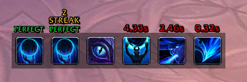
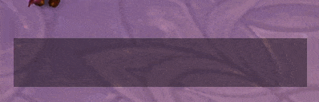

# Spell History Enhanced

A World of Warcraft addon that shows your recent spell casts and grades how
well you chained them together. Every time you cast, the addon measures the
gap between your global cooldowns: cast with no wasted time and you get a
**PERFECT**; keep it going and you build a combo streak.

It's a lightweight, movable bar of spell icons with at-a-glance feedback —
handy for practicing tight rotations and minimizing GCD downtime.

## Features

- **Cast history bar** — the icons of your most recent casts, newest on the
  right, shifting left as you keep casting.
- **GCD grading** — shows the time wasted between globals (e.g. `0.12s`) or
  `PERFECT` when you waste nothing (within your latency).
- **Combo streaks** — consecutive PERFECT casts build tiers: `STREAK`,
  `RAMPAGE`, `INSANE`, `GODLIKE`, `LEGEND`.
- **Animations** — icons animate in as you cast and out as they age off the
  end of the bar. Choose a style (None, Fade, Slide, Bounce) and speed.
- **Ignore list** — exclude spells you don't care about (procs, racials).
  Right-click a history icon and choose **Ignore**, or manage the list in the
  settings by spell ID, name, or link.
- **Trinket use** — optionally shows equipped trinket on-use activations in the
  bar (toggle in settings, on by default).
- **Custom border** — an optional border around the bar with adjustable
  thickness and either your class color or a custom color.
- **Stats panel** — an optional on-screen readout of the current fight: GCD
  uptime, PERFECT count and rate, best combo, average wasted time, casts, and
  session length. Also available via `/she`.
- **Per-spec profiles** — every setting (position, size, animations, ignore
  list, stats panel, ...) is saved separately for each specialization and
  switches automatically when you change spec.
- **Shift-drag to move** — hold **Shift** and drag the bar (or any icon) to
  reposition it; right-click for a quick menu (ignore a spell, hide, settings,
  clear).
- **Grid & snap** — optional alignment grid with snapping for precise placement.
- **In-game settings** — a native Settings panel to adjust max icons, scale,
  background transparency, border, trinket display, restart timeout, the spell
  queue window, and animation style/speed.
- **Spell tooltips** — hover any icon to see the spell tooltip.
- **Pet battle aware** — hides itself during pet battles.

## Installation

**With an addon manager** (recommended): install via your manager of choice
(CurseForge, WoWUp, etc.) and let it keep the addon updated.

**Manual install:**

1. Download or clone this repository.
2. Copy the folder into your WoW AddOns directory, e.g.
   `World of Warcraft/_retail_/Interface/AddOns/SpellHistoryEnhanced`.
3. Make sure the folder is named `SpellHistoryEnhanced` and contains
   `SpellHistoryEnhanced.toc` at its root.
4. Restart WoW (or `/reload`) and enable the addon at the character select
   screen.

## Usage

- **Move it:** hold **Shift** and drag the bar — grab any icon, or the empty
  bar area when it's idle. The position is saved automatically.
- **Right-click** the bar for a quick menu: **Ignore** the spell (when you
  click an icon), **Hide cast list**, **Open options**, or **Clear list**.
- The on-screen **stats panel** has a small gear button (top-right) with
  **Hide**, **Reset stats**, and **Open options**; Shift-drag it to move it.
- Open the full settings via the game's **AddOns options panel**
  (`Esc → Options → AddOns → SpellHistoryEnhanced`).

### Settings

| Setting | What it does |
| --- | --- |
| **Restart Timeout** | How long a gap (seconds) before a new cast counts as a fresh `START`/`RESTART` instead of continuing the combo. |
| **Use Grid & Snap** | Shows an alignment grid and snaps the bar to it while moving. |
| **Show Trinket Use** | Show equipped trinket on-use activations in the cast list. |
| **Show Cast List** | Show or hide the cast bar entirely. |
| **Max Icons** | How many past casts to show (4–12). |
| **Background Transparency** | Opacity of the bar background. |
| **UI Scale** | Overall size of the bar (50%–200%). |
| **Border Size** | Border thickness around the bar: None, Thin, Normal, Heavy, or Strong. |
| **Border Color** | Class color, or a custom color chosen with the color picker. |
| **Spell Queue Window** | Adjusts the game's `SpellQueueWindow` CVar. Higher values queue pre-input spells more smoothly; lower values react faster but are more ping-sensitive. |
| **Animation Style** | How icons enter/leave the bar: None, Fade, Slide, or Bounce. |
| **Animation Speed** | Duration of the animations (0.1s–0.6s). |
| **Statistics** (subpage) | Toggle the on-screen stats panel and see a summary of the current/last fight, with Refresh and Reset buttons. |
| **Ignore List** (subpage) | Spells excluded from tracking. Add by ID/name/link or right-click a history icon and choose Ignore; remove them here. |

Settings are saved per specialization and switch automatically when you change
spec; a fresh spec starts from your current settings.

There are also buttons to clear the history and reset the bar position to
center.

## Slash commands

- `/she` (or `/spellhistory`) — print the current/last fight's statistics.
- `/she reset` — reset the statistics.

## Planned Features

The original roadmap (animations, ignore list, stats & session tracking, and
per-spec profiles) is now implemented. Have an idea for what's next? Open an
issue — see below.

## Contributing

Contributions and translations are welcome! See [CONTRIBUTING.md](CONTRIBUTING.md)
for development setup, code style, and how to add a new language.

## License

Released under the [MIT License](LICENSE).
